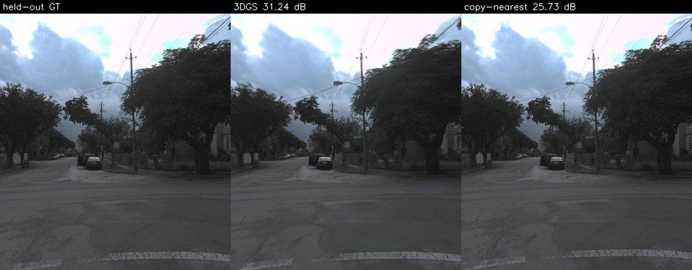
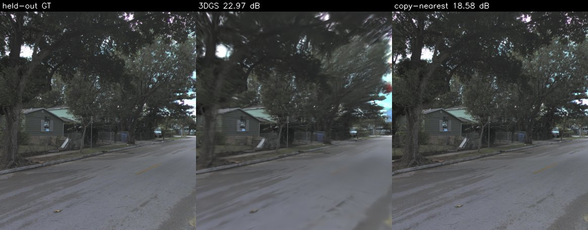
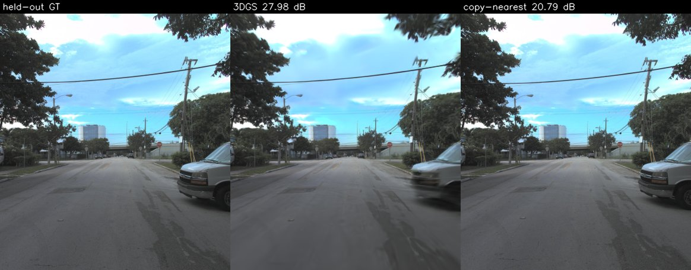

# driving-3dgs：单段车载前视视频的 3D Gaussian Splatting 重建（Argoverse 2）

> 2026-09-26 新建的个人项目（当天从零搭建），不是过往实习或课程经历。当天跑完 7000 次迭代的主结果与稀疏视角对照，并导出了高斯点云和浏览器预览；30k 迭代没有跑完，见“未完成的部分”。

## 这是什么

用 **Argoverse 2（AV2）传感器数据集**里一段约 8 秒（160 帧，20 Hz）的前视相机视频 + 数据集自带的标定与自车位姿，
训练 **3D Gaussian Splatting（3DGS）** 场景表示，在**留出帧**（训练时从未见过的时刻）上渲染并与真值比对，
并导出高斯点云（PLY）和浏览器预览页（`docs/preview.html`，用 three.js 显示高斯中心点和相机轨迹，不是 splat 渲染）。

整条链路：

1. **位姿**：`city_SE3_cam(t) = city_SE3_ego(t) @ ego_SE3_cam`，按图像时间戳查自车位姿（本段 160 帧的时间戳都能在位姿表里精确命中，插值代码有单测但本次运行没有用到），再平移到训练相机中心附近以保证 float32 精度。
2. **图像**：按标定的 k1/k2/k3 去畸变 → 裁掉底部自车引擎盖 → 缩到 388×456（GTX 1650 4 GB 显存）。
3. **划分**：每 8 帧留出 1 帧做评测（确定性、无随机），另有只用每 4 帧中 1 帧训练的“稀疏视角”对照（`sparse4_7k`）。
4. **初始化**：同一 log 的激光雷达扫描（每 2 帧取 1 帧）转到世界系，只保留被**训练**相机看到的点并用训练图像上色，体素下采样；天空/远景另撒一层远距离点。留出帧的图像在初始化和训练中都不读取。
5. **训练**：[gsplat](https://github.com/nerfstudio-project/gsplat) 的 CUDA 光栅化器 + `DefaultStrategy` 自适应加密/剪枝，损失 0.8·L1 + 0.2·(1−SSIM)。
6. **评测**：留出帧 PSNR / SSIM（NumPy 实现，单测里与 scikit-image 对齐到 1e-6）/ LPIPS(Alex)，与两个基线对比：
   - **复制最近训练帧**：直接拿时间上最近的训练帧当预测——“什么都不重建”的下限；
   - **仅初始化**：激光雷达上色点、0 次优化直接渲染——说明优化本身带来了多少。
7. **导出**：标准 3DGS PLY + three.js 点云预览（高斯中心着色点，不是真正的 splat 渲染）——脚本已写，**尚未运行**。

## 这不是什么

- **不是量产级重建**：单段约 8 秒、单个前视相机、低分辨率；没有多相机联合、没有曝光补偿、没有位姿优化。
- **不处理动态物体**：行驶中的车辆/行人没有单独建模，只能被当成静态场景去拟合；本段是用 `scripts/scout_logs.py` 在验证集前 40 个 log 里按“标注目标中移动超过 3 m 的数量”挑的最少者（整段 4 个），但并非完全静态。时间窗取该 log 的第 20–179 帧，因为自车在约第 9 s 后停车。
- **留出帧不是新视角外推**：留出帧夹在训练帧中间（插值），离开行驶轨迹的新视角质量没有评测。
- **受 4 GB 显存约束**：迭代数、分辨率都按 GTX 1650 取值；没有与官方 3DGS / 其他方法在公开基准上的对比。
- 预览页只画高斯中心点，想看真正的 splat 效果需要把 PLY 拖进支持 3DGS 的查看器（自行选择）。

## 结果（真实运行，数字由 `results/runs/*.json` 生成）

<!-- BEGIN:setup -->
- 数据：Argoverse 2 Sensor Dataset (val split)，log `15ec0778-826e-3ed7-9775-54fbf66997f4`，相机 `ring_front_center`，连续 160 帧（7.95 s，自车轨迹 36.5 m）
- 下载：204 个文件，共 93.3 MB（160 张 JPEG + 40 帧激光雷达 + 标定/位姿/标注）
- 分辨率 388×456；每 8 帧留出 1 帧 → 训练 140 / 留出 20
- 初始化：激光雷达点 200,000 个（体素 0.08 m）+ 远景天空壳 20,000 个
- 硬件/软件：NVIDIA GeForce GTX 1650，torch 2.4.1+cu124，gsplat 1.5.3+pt24cu124
<!-- END:setup -->

<!-- BEGIN:results -->
| 运行 | 训练帧 | 迭代 | 方法 | 留出帧 PSNR↑ | SSIM↑ | LPIPS↓ | PSNR 高于复制基线的留出帧数 |
|---|---|---|---|---|---|---|---|
| `full_7k` | 140 | 7000 | 3DGS（本项目） | 27.76 | 0.871 | 0.192 | 20/20 |
| `full_7k` | 140 | — | 基线：复制时间最近的训练帧 | 20.71 | 0.651 | 0.118 |  |
| `full_7k` | 140 | — | 基线：仅初始化（0 次迭代） | 17.76 | 0.648 | 0.730 |  |
| `sparse4_7k` | 20 | 7000 | 3DGS（本项目） | 23.79 | 0.777 | 0.189 | 20/20 |
| `sparse4_7k` | 20 | — | 基线：复制时间最近的训练帧 | 17.06 | 0.556 | 0.283 |  |
| `sparse4_7k` | 20 | — | 基线：仅初始化（0 次迭代） | 18.07 | 0.655 | 0.729 |  |

| 运行 | 训练用时 (s) | 峰值显存 allocated / reserved (MB，torch 统计，不含 CUDA 上下文) | 高斯数 初始 → 最终 | 训练视角 PSNR / SSIM（每 7 个训练帧抽 1 帧；过拟合参照） |
|---|---|---|---|---|
| `full_7k` | 347.9 | 852 / 1202 | 220,000 → 557,802 | 28.61 / 0.888 |
| `sparse4_7k` | 368.5 | 989 / 1510 | 220,000 → 650,205 | 33.34 / 0.953 |
<!-- END:results -->

读法：

- `full_7k`：140 帧训练、20 帧留出；留出帧与最近训练帧相隔 1 帧（50 ms，自车约走 0.2 m），是“沿轨迹插值”的容易设置。
- PSNR/SSIM 上 3DGS 在 20 个留出帧上全部高于复制基线；但 **LPIPS 上复制基线更好**——复制来的是一张真实照片，纹理锐利、只是错位，
  而 3DGS 渲染在树冠、远处和路面纹理上发糊、有拉丝（见下图）。两类指标衡量的东西不同，表里如实列出，不挑有利的那个。
- 训练视角与留出帧的差距是过拟合程度的参照；“仅初始化”一行说明激光雷达上色点本身离可用的渲染还很远，提升来自优化。
- gsplat 反向传播使用原子加，同一种子重跑在小数点后几位会有差异（本机两次 7k 训练的留出 PSNR 相差约 0.1 dB）。

### 稀疏视角对照（sparse4_7k）

- 只用每 4 帧中 1 帧训练（20 帧），留出帧距最近训练帧 200 ms。此时 3DGS 在 PSNR、SSIM、LPIPS 三项上都优于“复制最近帧”基线——
  复制基线在视角差变大后错位明显，LPIPS 也变差；而 `full_7k` 里 LPIPS 是复制基线更好。
- 训练视角与留出帧的 PSNR 差距从 `full_7k` 的约 0.9 dB 拉大到约 9.5 dB：训练帧少时过拟合明显。

### 未完成的部分（如实记录）

- `full_30k`（30 000 次迭代）没有跑完：训练到约 2.25 万步后速度从约 8 步/秒掉到约 0.25 步/秒，同一块 4 GB GPU 上当时还有一个
  不属于本项目的 Ollama `llama-server` 进程，显存争用是最可能的原因（未坐实）。该进程已被手动中止，30k 没有结果，表中也不列。
- 导出用的是 `full_7k` 模型：PLY（557,802 个高斯，约 138 MB，太大不入库）和 `docs/preview.html`（抽取不透明度 > 0.5 的 138,386 个中心点）；
  预览页在本机无头 Chromium 中打开验证过，无控制台报错。

留出帧对比图（左：真值，中：3DGS 渲染，右：复制最近训练帧；标题里是该帧 PSNR）：





## 数据与许可

- 数据：**Argoverse 2 Sensor Dataset**（val split），从公开桶 `s3://argoverse/datasets/av2/sensor/` 用匿名 HTTPS 下载，**无需注册或登录**，只下了一个 log 的一小段（见上表下载量）。
- 许可（2026-09-26 核对 <https://www.argoverse.org/about.html#terms-of-use>，页面标注 “last updated August 2, 2021”）：
  数据与文档采用 **CC BY-NC-SA 4.0**（署名-非商业性使用-相同方式共享）；代码与 API 为 MIT。
  条款写明 “By using or downloading Argoverse, you … are agreeing to comply with the terms of use”，
  即下载即视为同意；条款只允许**非商业**用途，并禁止用于再识别个人。
- 署名：**Data © 2021 Argo AI, LLC**，CC BY-NC-SA 4.0（<https://creativecommons.org/licenses/by-nc-sa/4.0/>）。
  本仓库 `docs/img/` 下的对比图是 AV2 图像及其衍生渲染，同样按 CC BY-NC-SA 4.0 提供，仅作非商业的技术展示。
  仓库不包含任何原始数据、训练产物或模型文件。
- 引用：B. Wilson et al., *Argoverse 2: Next Generation Datasets for Self-Driving Perception and Forecasting*, NeurIPS Datasets and Benchmarks, 2021。
- 方法：B. Kerbl et al., *3D Gaussian Splatting for Real-Time Radiance Field Rendering*, SIGGRAPH 2023；实现使用 gsplat（Apache-2.0）。

## 复现

环境（Windows 11，GTX 1650 4 GB，驱动 592.82）。gsplat 在 Windows 上只有 Python 3.10 + torch ≤ 2.4 的预编译轮子，
本机没有 nvcc，所以单独建了一个环境（放在数据盘）：

```bash
conda create -y -p D:/driving-3dgs/env python=3.10 pip
D:/driving-3dgs/env/python.exe -m pip install torch==2.4.1 torchvision==0.19.1 --index-url https://download.pytorch.org/whl/cu124
D:/driving-3dgs/env/python.exe -m pip install "gsplat==1.5.3+pt24cu124" --index-url https://docs.gsplat.studio/whl/pt24cu124 --extra-index-url https://pypi.org/simple
D:/driving-3dgs/env/python.exe -m pip install -r requirements.txt
```

一键跑完（Git Bash；数据与产物全部写到 `D:/driving-3dgs`，仓库只写 `results/` 下的 JSON）：

```bash
bash scripts/run_all.sh
```

其中各步：

```bash
PY=D:/driving-3dgs/env/python.exe; LOG=15ec0778-826e-3ed7-9775-54fbf66997f4
$PY scripts/download_av2.py --out D:/driving-3dgs/data --split val --log $LOG --start 20 --num-frames 160 --lidar-every 2
$PY scripts/prepare.py  --log-dir D:/driving-3dgs/data/$LOG --out D:/driving-3dgs/work/full
$PY scripts/prepare.py  --log-dir D:/driving-3dgs/data/$LOG --out D:/driving-3dgs/work/sparse4 --train-stride 4
$PY scripts/train.py    --work D:/driving-3dgs/work/full --out D:/driving-3dgs/runs/full_30k --steps 30000
$PY scripts/evaluate.py --work D:/driving-3dgs/work/full --run D:/driving-3dgs/runs/full_30k --results results/runs/full_30k.json --figs D:/driving-3dgs/runs/full_30k/figs
$PY scripts/export.py   --run D:/driving-3dgs/runs/full_30k --work D:/driving-3dgs/work/full --out D:/driving-3dgs/export/full_30k
$PY scripts/check_readme.py --check      # README 表格与 JSON 不一致就失败
$PY -m pytest -q                         # 位姿/划分/指标单测
$PY scripts/mutation_check.py            # 变异检查，结果写入 MUTATION.md
```

LPIPS 的 AlexNet 权重会下载到 `D:/driving-3dgs/torch_home`（`evaluate.py --torch-home`）。

## 目录

```
d3gs/            geometry.py 位姿数学 · split.py 划分 · metrics.py PSNR/SSIM · av2io.py 读 AV2 · scene.py 训练/渲染辅助
scripts/         download_av2 → prepare → train → evaluate → export；check_readme；mutation_check；run_all.sh
tests/           位姿往返、已知变换、内参缩放、划分确定性、指标（含与 scikit-image 对拍）
results/         data_manifest.json（下载清单）· runs/*.json（每次运行的逐帧指标与汇总）
docs/img/        少量留出帧对比图（每张 < 300 KB）
MUTATION.md      变异检查记录
```

## English summary

A small, reproducible driving-scene reconstruction: one 8-second clip of the Argoverse 2 front-centre camera
(public bucket, anonymous download) with the dataset's own calibration and ego poses, lidar-initialised
3D Gaussian Splatting trained with gsplat on a 4 GB GTX 1650, evaluated on held-out frames against a
copy-nearest-frame baseline and an initialisation-only baseline. A 3DGS-PLY / three.js preview exporter is
included but has **not yet been run**, and the planned 30k-iteration and sparse-view runs did not finish in
this session (the GPU became shared with an unrelated process; see the Chinese section). It is **not** a production reconstruction: single short clip,
single camera, no dynamic-object handling, no exposure or pose refinement, held-out frames are
interpolations along the driven path rather than novel off-trajectory views. Data © 2021 Argo AI, LLC,
CC BY-NC-SA 4.0 (non-commercial). Created 2026-09-26 as a new personal project; every number in the results tables is
generated from `results/runs/*.json` and `scripts/check_readme.py --check` fails if they diverge.
