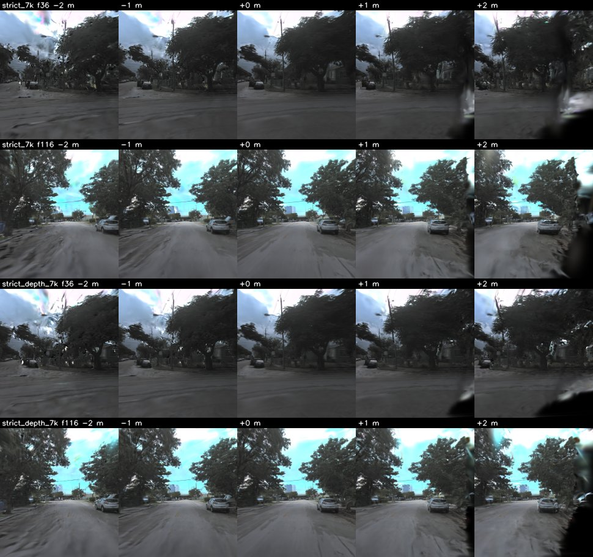
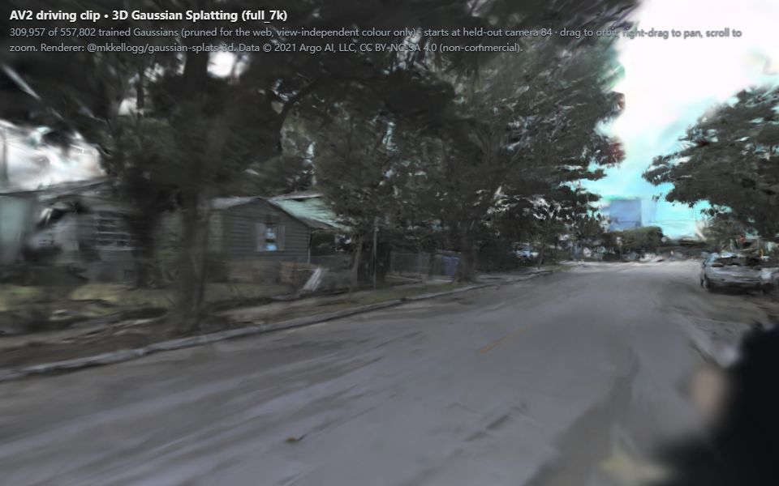

# driving-3dgs：单段车载前视视频的 3D Gaussian Splatting 重建（Argoverse 2）

> 2026-09-26 新建的个人项目（当天从零搭建），不是过往实习或课程经历。第一轮：7000 次迭代主结果、稀疏视角对照、高斯点云预览。
> 第二轮（同日）：30k 迭代、基于标注的动态物体掩膜、激光雷达深度监督与留出帧深度评测、网页 splat 查看器、偏离轨迹视角。

## 这是什么

用 **Argoverse 2（AV2）传感器数据集**里一段约 8 秒（160 帧，20 Hz）的前视相机视频 + 数据集自带的标定与自车位姿，
训练 **3D Gaussian Splatting（3DGS）** 场景表示，在**留出帧**（训练时从未见过的时刻）上渲染并与真值比对。

整条链路：

1. **位姿**：`city_SE3_cam(t) = city_SE3_ego(t) @ ego_SE3_cam`，按图像时间戳查自车位姿（本段 160 帧的时间戳都能在位姿表里精确命中，插值代码有单测但本次运行没有用到），再平移到训练相机中心附近以保证 float32 精度。
2. **图像**：按标定的 k1/k2/k3 去畸变 → 裁掉底部自车引擎盖 → 缩到 388×456（GTX 1650 4 GB 显存）。
3. **划分**：每 8 帧留出 1 帧做评测（确定性、无随机），另有只用每 4 帧中 1 帧训练的“稀疏视角”对照（`sparse4_7k`）。
4. **初始化**：激光雷达扫描转到世界系，只保留被**训练**相机看到的点并用训练图像上色，体素下采样；天空/远景另撒一层远距离点。留出帧的图像在初始化和训练中都不读取。
5. **训练**：[gsplat](https://github.com/nerfstudio-project/gsplat) 的 CUDA 光栅化器 + `DefaultStrategy` 自适应加密/剪枝，损失 0.8·L1 + 0.2·(1−SSIM)；
   可选：把移动物体像素排除出损失（`--mask moving`），加激光深度 L1（`--depth-lambda`）。
6. **评测**：留出帧 PSNR / SSIM（NumPy 实现，单测里与 scikit-image 对齐到 1e-6）/ LPIPS(Alex)，全图和“只算静态像素”各一套；
   与“复制最近训练帧”“仅初始化”两个基线对比；另用**留出帧专用的激光扫描**评测渲染深度。
7. **导出**：标准 3DGS PLY；`docs/preview.html`（高斯中心点云 + 相机轨迹）；`docs/splat/viewer.html`（真正的 splat 渲染，网页可交互）。

### 动态物体掩膜（`d3gs/dynamic.py`）

- 来源是 AV2 的**人工标注长方体**（`annotations.feather`，10 Hz），不是检测器：每条轨迹转到城市坐标系，用 ±0.5 s 的中心位移估速度，
  速度 > 1 m/s 记为“移动”；按图像时间戳在相邻两次标注间插值（中心线性、旋转 slerp）。
- 长方体每边外扩 0.25 m，12 条棱先对近平面裁剪再投影（相机后方的角点直接投影会镜像到画面另一侧），取凸包、裁到画框、按像素中心是否在多边形内填充。
- 训练时把掩膜内像素替换成真值再算损失，这些像素对 L1/SSIM 的贡献和梯度恰好为 0。评测时同一套掩膜（留出帧的）定义“静态像素”，只用于算指标。
- 也生成了“全部车辆”掩膜（含停着的车），本轮没有拿它训练。

### 激光深度与“评测扫描”隔离（`d3gs/lidar.py`）

- 每个留出帧时间上最近的那一帧激光扫描（本段都在 ±11 ms 内）被划为**评测扫描**，只给留出帧的深度评测用；其余扫描才能进初始化或深度监督。
  `prepare.py`、`train.py`、`evaluate.py` 三处都调用 `assert_no_lidar_leak` 检查；`Scene.train_depth()` 对留出帧直接拒绝。
- **第一轮的原始初始化（`full_*`、`sparse4_*`）读了全部 40 帧扫描，其中 20 帧恰好是评测扫描**——这对图像指标无影响（留出帧图像从未读取），
  但对深度评测是泄漏，所以第二轮的对比实验改用 `strict` 初始化（去掉评测扫描），原始运行的深度数字只作泄漏对照、单独标注。
- 深度监督：每个训练帧取时间最近的非评测扫描投影成稀疏深度图（移动物体像素剔除），对 gsplat 渲染的期望深度（`RGB+ED`）做 L1，λ = 0.05，未调参。
- 评测：留出帧的评测扫描投影到该帧相机（z-buffer 取最近点，0.5–80 m），与渲染深度比较：中位绝对误差、误差 ≤ 0.5 m 的占比、AbsRel；
  20 帧所有激光像素合并统计。AV2 扫描已按扫描时刻做过运动补偿（在本段上验证过：按每点 `offset_ns` 再补偿一次，相邻扫描反而对得更差）。
- 局限：激光在车顶、相机在前挡风玻璃，两者视差会让少量激光点落到前景物体的像素上；中位数对此不敏感，但 ≤ 0.5 m 占比会被拉低。

## 这不是什么

- **不是量产级重建**：单段约 8 秒、单个前视相机、低分辨率；没有多相机联合、没有曝光补偿、没有位姿优化。
- **没有给动态物体建模**：只是把移动物体从损失里排除，它们在渲染里仍然是糊的或残影；掩膜来自人工标注（真值级），换成检测器会更差。
  本段是用 `scripts/scout_logs.py` 在验证集前 40 个 log 里按“移动超过 3 m 的标注目标数”挑的最少者，移动像素本来就很少，掩膜的收益上限也小。
- **留出帧是沿轨迹插值**：留出帧夹在训练帧中间；偏离轨迹的视角没有图像真值，只能看定性图和激光深度（见下）。
- **受 4 GB 显存约束**：迭代数、分辨率都按 GTX 1650 取值；没有与官方 3DGS / 其他方法在公开基准上的对比；每个配置只跑了一次（另有一个换种子的重复用来估噪声）。

## 结果（真实运行，数字由 `results/*.json` 生成，`scripts/check_readme.py --check` 不一致即失败）

<!-- BEGIN:setup -->
- 数据：Argoverse 2 Sensor Dataset (val split)，log `15ec0778-826e-3ed7-9775-54fbf66997f4`，相机 `ring_front_center`，连续 160 帧（7.95 s，自车轨迹 36.5 m）
- 下载：244 个文件，共 135.3 MB（160 张 JPEG + 80 帧激光雷达 + 标定/位姿/标注）
- 分辨率 388×456；每 8 帧留出 1 帧 → 训练 140 / 留出 20
- 初始化（原始 `full_*`）：激光雷达点 200,000 个（体素 0.08 m）+ 远景天空壳 20,000 个
- 初始化（严格 `strict_*`）：去掉留出帧的评测扫描后，激光雷达点 183,782 个 + 天空壳 20,000 个
- 硬件/软件：NVIDIA GeForce GTX 1650，torch 2.4.1+cu124，gsplat 1.5.3+pt24cu124
<!-- END:setup -->

### 原始设置：7k / 30k / 稀疏视角

<!-- BEGIN:results -->
| 运行 | 训练帧 | 迭代 | 方法 | 留出帧 PSNR↑ | SSIM↑ | LPIPS↓ | PSNR 高于复制基线的留出帧数 |
|---|---|---|---|---|---|---|---|
| `full_7k` | 140 | 7000 | 3DGS（本项目） | 27.76 | 0.871 | 0.192 | 20/20 |
| `full_7k` | 140 | — | 基线：复制时间最近的训练帧 | 20.71 | 0.651 | 0.118 |  |
| `full_7k` | 140 | — | 基线：仅初始化（0 次迭代） | 17.76 | 0.648 | 0.730 |  |
| `full_30k` | 140 | 30000 | 3DGS（本项目） | 29.87 | 0.902 | 0.107 | 20/20 |
| `full_30k` | 140 | — | 基线：复制时间最近的训练帧 | 20.71 | 0.651 | 0.118 |  |
| `full_30k` | 140 | — | 基线：仅初始化（0 次迭代） | 17.76 | 0.648 | 0.730 |  |
| `sparse4_7k` | 20 | 7000 | 3DGS（本项目） | 23.79 | 0.777 | 0.189 | 20/20 |
| `sparse4_7k` | 20 | — | 基线：复制时间最近的训练帧 | 17.06 | 0.556 | 0.283 |  |
| `sparse4_7k` | 20 | — | 基线：仅初始化（0 次迭代） | 18.07 | 0.655 | 0.729 |  |

| 运行 | 训练用时 (s) | 其中停顿多耗 (s)¹ | 峰值显存 allocated / reserved (MB，torch 统计，不含 CUDA 上下文) | 高斯数 初始 → 最终 | 训练视角 PSNR / SSIM（每 7 个训练帧抽 1 帧；过拟合参照） |
|---|---|---|---|---|---|
| `full_7k` | 347.9 | 0 | 852 / 1202 | 220,000 → 557,802 | 28.61 / 0.888 |
| `full_30k` | 4325.5 | 1085（2 段） | 2530 / 3862 | 220,000 → 1,677,839 | 32.48 / 0.940 |
| `sparse4_7k` | 368.5 | 0 | 989 / 1510 | 220,000 → 650,205 | 33.34 / 0.953 |
| `strict_7k` | 343.1 | 0 | 834 / 1282 | 203,782 → 544,511 | 28.51 / 0.886 |
| `strict_7k_seed1` | 385.3 | 0 | 831 / 1252 | 203,782 → 543,222 | 28.51 / 0.886 |
| `strict_mask_7k` | 338.5 | 0 | 809 / 1350 | 203,782 → 529,744 | 27.89 / 0.879 |
| `strict_depth_7k` | 567.7 | 0 | 1723 / 2592 | 203,782 → 1,137,881 | 27.36 / 0.867 |
| `strict_mask_depth_7k` | 603.6 | 0 | 1705 / 2848 | 203,782 → 1,125,029 | 27.06 / 0.862 |

¹ 训练日志每 500 步记一次时间；用时超过中位数 3 倍的段记为停顿，列出这些段超出中位数的总时长。
<!-- END:results -->

读法：

- `full_*`：140 帧训练、20 帧留出；留出帧与最近训练帧相隔 1 帧（50 ms，自车约走 0.2 m），是“沿轨迹插值”的容易设置。
- PSNR/SSIM 上 3DGS 在留出帧上高于复制基线；但 **LPIPS 上复制基线更好**——复制来的是一张真实照片，纹理锐利、只是错位，
  而 3DGS 渲染在树冠、远处和路面纹理上发糊、有拉丝（见下图）。两类指标衡量的东西不同，表里如实列出，不挑有利的那个。
- `sparse4_7k` 只用每 4 帧中 1 帧训练（20 帧），留出帧距最近训练帧 200 ms：3DGS 三项指标都优于复制基线，但训练视角与留出帧差距明显拉大（过拟合）。
- gsplat 反向传播使用原子加，同一种子重跑在小数点后几位会有差异；下文用一个换种子的重复估计噪声量级。

### 全图 vs 静态像素；动态物体掩膜与深度监督（`strict_*` 为严格初始化，均 7000 次迭代）

<!-- BEGIN:ablation -->
| 运行 | 训练时排除的像素 | 深度监督 λ | 种子 | 全图 PSNR↑ | 全图 SSIM↑ | 全图 LPIPS↓ | 静态像素 PSNR↑ | 静态 SSIM↑ | 静态 LPIPS↓ |
|---|---|---|---|---|---|---|---|---|---|
| `full_7k` | — | — | 0 | 27.76 | 0.871 | 0.192 | 27.75 | 0.871 | 0.193 |
| `full_30k` | — | — | 0 | 29.87 | 0.902 | 0.107 | 29.86 | 0.902 | 0.107 |
| `sparse4_7k` | — | — | 0 | 23.79 | 0.777 | 0.189 | 23.85 | 0.781 | 0.188 |
| `strict_7k` | — | — | 0 | 27.64 | 0.869 | 0.200 | 27.63 | 0.869 | 0.200 |
| `strict_7k_seed1` | — | — | 1 | 27.60 | 0.868 | 0.198 | 27.58 | 0.868 | 0.199 |
| `strict_mask_7k` | 移动物体 | — | 0 | 27.18 | 0.862 | 0.203 | 27.58 | 0.868 | 0.200 |
| `strict_depth_7k` | — | 0.05 | 0 | 26.58 | 0.848 | 0.219 | 26.61 | 0.850 | 0.219 |
| `strict_mask_depth_7k` | 移动物体 | 0.05 | 0 | 26.29 | 0.843 | 0.221 | 26.62 | 0.849 | 0.218 |
| 基线：复制最近训练帧 | — | — | — | 20.71 | 0.651 | 0.118 | 20.67 | 0.653 | 0.118 |

- 静态像素 = 不在任何“移动物体”投影内的像素（AV2 标注长方体，速度 > 1.0 m/s，每边外扩 0.25 m）；20 个留出帧中 7 帧有移动物体，移动像素平均占 1.6%。
<!-- END:ablation -->

### 留出帧深度误差（对照留出帧专用的激光扫描）

<!-- BEGIN:depth -->
| 运行 | 初始化/监督是否用到留出帧的评测扫描 | 深度监督 λ | 方法 | 中位绝对误差 (m)↓ 全部 / 静态 | ≤ 0.5 m 占比↑ 全部 / 静态 | 按激光距离分段的中位误差 (m，静态) 0–10 / 10–20 / 20–40 / 40–80 m | 激光点像素数 |
|---|---|---|---|---|---|---|---|
| `full_7k` | **是（泄漏，仅作对照）** | — | 3DGS 渲染深度 | 3.44 / 3.40 | 9.3% / 9.0% | 0.98 / 1.82 / 4.91 / 10.44 | 243,518 |
| `full_30k` | **是（泄漏，仅作对照）** | — | 3DGS 渲染深度 | 4.80 / 4.81 | 5.0% / 4.5% | 1.33 / 2.61 / 6.66 / 15.00 | 243,518 |
| `sparse4_7k` | **是（泄漏，仅作对照）** | — | 3DGS 渲染深度 | 3.02 / 3.00 | 12.0% / 12.0% | 0.93 / 1.82 / 4.23 / 7.50 | 243,518 |
| `strict_7k` | 否（严格） | — | 3DGS 渲染深度 | 3.18 / 3.14 | 12.1% / 12.0% | 0.73 / 1.66 / 4.36 / 10.33 | 243,518 |
| `strict_7k_seed1` | 否（严格） | — | 3DGS 渲染深度 | 3.03 / 2.97 | 12.0% / 11.9% | 0.81 / 1.60 / 4.36 / 9.58 | 243,518 |
| `strict_mask_7k` | 否（严格） | — | 3DGS 渲染深度 | 3.19 / 3.17 | 11.4% / 11.4% | 0.79 / 1.70 / 4.55 / 10.25 | 243,518 |
| `strict_depth_7k` | 否（严格） | 0.05 | 3DGS 渲染深度 | 0.15 / 0.14 | 73.6% / 75.4% | 0.12 / 0.15 / 0.12 / 0.28 | 243,518 |
| `strict_mask_depth_7k` | 否（严格） | 0.05 | 3DGS 渲染深度 | 0.15 / 0.14 | 73.7% / 75.4% | 0.12 / 0.15 / 0.12 / 0.28 | 243,518 |
<!-- END:depth -->

### 关键差异（由上表 JSON 计算）

<!-- BEGIN:findings -->
- 30k vs 7k（同一初始化）：留出 PSNR +2.11 dB，LPIPS -0.085；训练视角 PSNR +3.86 dB；训练用时 ×12.4，高斯数 ×3.0
- 同配置换种子（`strict_7k` vs `strict_7k_seed1`）：全图 PSNR 差 0.05 dB，静态 PSNR 差 0.05 dB——小于这个量级的差异不当作效果
- 排除移动物体像素（`strict_mask_7k` − `strict_7k`）：全图 PSNR -0.47 dB，静态 PSNR -0.04 dB，静态 LPIPS ±0.000
- 激光深度监督（`strict_depth_7k` − `strict_7k`）：留出帧深度中位误差 3.14 → 0.14 m（静态像素），≤ 0.5 m 占比 12.0% → 75.4%；全图 PSNR -1.06 dB，LPIPS +0.019
- 初始化是否含评测扫描（`full_7k` 含 / `strict_7k` 不含；两者初始化只差这 20 帧扫描）：留出帧深度中位误差 3.40 / 3.14 m，≤ 0.5 m 占比 9.0% / 12.0%；全图 PSNR +0.12 dB（前者减后者）
<!-- END:findings -->

读法（第二轮）：

- **30k**：同一初始化下三项图像指标都比 7k 好，LPIPS 也低于复制基线了（7k 时是复制基线更好），说明 7k 的 LPIPS 劣势主要是欠训练；
  但代价是训练时间和显存成倍增加，而且**渲染深度反而更差**（见深度表）——多出来的高斯在拟合外观，几何没有因此变准。
  另外 30k 的提升大半在视角相关的高阶球谐上：只保留 0 阶颜色时，30k 与 7k 几乎一样（见“网页查看器”）。
- **动态物体掩膜**：把移动物体像素排除出损失后，静态像素指标的变化在换种子的噪声以内，全图指标变差（移动物体不再被拟合）。
  本段移动像素本来就少（见表下注），掩膜又是人工标注级的，所以这是“收益上限也很小”的场景；它没有带来可测的静态区域改善，这里如实记为无效果。
- **激光深度监督**：留出帧深度误差降了一个数量级、各距离段都降，图像指标则下降（见“关键差异”）、高斯数和训练时间、显存都明显上升——
  深度损失的梯度也在触发加密。λ 只试了 0.05 一个值，没有调参，这个权衡点未必最优。掩膜 + 深度（`strict_mask_depth_7k`）与只加深度的深度指标几乎相同。
- **初始化泄漏对照**：原始初始化读过评测扫描，但它的深度误差并没有更好（见上）。泄漏在这一段上碰巧没有让数字变好，这是隔离之后才知道的；
  隔离是深度评测成立的前提，不是一个“效果”。
- 深度误差主要来自远处：未加深度监督时，0–10 m 内中位误差不到 1 m，40 m 以外到 10 m 量级（见分段列）。

### 偏离轨迹的视角（相机沿自身 x 轴平移，无图像真值）

<!-- BEGIN:offpath -->
| 运行 | 指标 | -2 m | -1 m | +0 m | +1 m | +2 m |
|---|---|---|---|---|---|---|
| `strict_7k` | 深度中位误差 (m) vs 激光 | 2.61 | 2.66 | 3.18 | 3.80 | 3.57 |
| `strict_7k` | 深度 ≤ 0.5 m 占比 | 16.2% | 14.3% | 12.1% | 11.8% | 12.0% |
| `strict_7k` | 空洞像素（α < 0.5） | 1.2% | 0.3% | 0.1% | 1.7% | 5.4% |
| `strict_depth_7k` | 深度中位误差 (m) vs 激光 | 0.24 | 0.18 | 0.15 | 0.20 | 0.28 |
| `strict_depth_7k` | 深度 ≤ 0.5 m 占比 | 63.7% | 69.2% | 73.6% | 67.5% | 59.6% |
| `strict_depth_7k` | 空洞像素（α < 0.5） | 1.0% | 0.3% | 0.1% | 2.0% | 5.7% |
<!-- END:offpath -->



上图：每行一个模型 × 一个留出帧，列为相机向左 2 m、1 m、原位、向右 1 m、2 m（+ 为图像右方）。看到的问题：

- **向右平移时右侧边缘出现大块深色“漂浮物”**：紧贴相机右侧、训练视野边缘之外的区域只被少数高斯粗略覆盖，
  平移后这些离相机很近的大高斯挡住了画面（从渲染看是这样，没有逐个高斯核实）；这也是 α < 0.5 空洞像素在 +2 m 最多的原因。深度监督对此几乎没有帮助（空洞比例相近），
  因为那里本来就没有激光或图像约束。
- **向左平移时**路面出现沿行驶方向的拉丝，树冠边缘和天空交界处有破碎的高亮斑点；天空壳离得远，视差小，平移后基本正常。
- **几何**：把留出帧的评测扫描重新投影到平移后的相机里比较深度，未加深度监督的模型在各偏移下中位误差都在米级；
  加了深度监督的模型在 ±2 m 仍保持在亚米级（见表）。也就是说深度监督让“离开轨迹后的几何”可信得多，但并没有修好外观上的漂浮物。
- 没有图像真值，所以这里不报 PSNR；上面的数字只衡量几何与覆盖，不衡量画面好不好看。

### 网页查看器

<!-- BEGIN:web -->
- 资产：`docs/splat/full_7k.splat`，309,957 / 557,802 个高斯（不透明度 ≥ 0.05，按 不透明度×投影面积 取前 600,000 个），9.9 MB（每个 32 字节）
- 同一批留出帧上用 gsplat 渲染的 PSNR：完整模型 27.76 dB → 只保留 0 阶球谐（.splat 格式只存视角无关颜色）27.00 dB → 网页实际加载的子集 26.56 dB
- 渲染器：@mkkellogg/gaussian-splats-3d@0.4.7 + three@0.160.0 (jsDelivr)；初始视角为留出帧 84 的相机
- 选资产时比较过的候选（同一导出代码；网页子集在留出帧上的 PSNR）：`full_30k` 保留 400,000 个 / 12.8 MB → 22.16 dB；`full_30k` 保留 600,000 个 / 19.2 MB → 25.12 dB；`full_7k` 保留 557,802 个 / 17.8 MB → 27.00 dB；`full_7k` 保留 309,957 个 / 9.9 MB → 26.56 dB
- 无头 Chromium（--use-gl=swiftshader --enable-webgl --ignore-gpu-blocklist）检查：通过；加载并渲染前 10 帧用时 40.2 s，控制台错误 0 条，失败请求 0 个；画布非背景像素 88.2%；WebGL 后端 `ANGLE (Google, Vulkan 1.3.0 (SwiftShader Device (Subzero) (0x0000C0DE)), SwiftShader driver)`；截图 `docs/img/viewer_headless.jpg`
<!-- END:web -->



- 上图是 `scripts/check_viewer.cjs` 在无头 Chromium（SwiftShader 软件 WebGL）里打开 `docs/splat/viewer.html` 的截图，脚本同时检查了控制台错误、失败请求和画布是否非空。
- 选的是 `full_7k`：30k 模型剪到相近大小后，网页子集的 PSNR 反而低（它的高斯数多得多，剪到可入库的大小要丢掉大部分），而 `full_7k` 去掉不透明度 < 0.05 的高斯后
  数量和 PSNR 损失见上表。资产 < 20 MB，直接入库。
- 网页视口比训练相机宽，初始视角两侧会露出训练时没看到的区域（右侧的深色块即上文的“漂浮物”）。
- 旧的点云预览 `docs/preview.html` 保留：它画的是高斯中心和相机轨迹，适合看整体布局；splat 查看器看的是渲染效果。

留出帧对比图（`full_7k`；左：真值，中：3DGS 渲染，右：复制最近训练帧；标题里是该帧 PSNR）：


### 未完成 / 不理想的部分（如实记录）

- **30k 的训练用时里有停顿**：训练日志中有两段 500 步明显变慢（计时表里的“停顿多耗”），不是稳定的吞吐。当时 GPU 上只有本项目的进程，
  但 torch 的保留显存已接近 4 GB 上限、GPU 温度约 90 °C 且驱动报告了软件温控降频、同一台机器上另一个会话在跑满 CPU 的测试；
  哪一个是主因没有坐实。第一轮 30k 在约 2.25 万步后几乎停滞，这一轮在同一区间出现停顿后恢复并跑完。30k 的时间数字请连同停顿一起看。
- **30k 的训练过程中本会话还在同机做了少量 CPU 工作**（生成 `strict` 数据、一次网页查看器冒烟测试），对计时有轻微影响。
- **动态物体掩膜没有带来可测收益**（见上）；“全部车辆”掩膜生成了但没有训练对照。
- **深度监督只试了一个 λ**，图像质量有所下降，没有做权衡曲线；也没有尝试逆深度、置信度加权或只在前期施加等常见做法。
- **偏离轨迹的漂浮物没有解决**；只做了定性图和基于激光的几何检查。
- `strict_mask_depth_7k` 第一次运行被中断（与代码无关），表里是从头重跑的结果。

## 数据与许可

- 数据：**Argoverse 2 Sensor Dataset**（val split），从公开桶 `s3://argoverse/datasets/av2/sensor/` 用匿名 HTTPS 下载，**无需注册或登录**，只下了一个 log 的一小段（见上表下载量；第二轮补下了同一时间窗内另外 40 帧激光扫描，没有下载其他 log）。
- 许可（2026-09-26 核对 <https://www.argoverse.org/about.html#terms-of-use>，页面标注 “last updated August 2, 2021”）：
  数据与文档采用 **CC BY-NC-SA 4.0**（署名-非商业性使用-相同方式共享）；代码与 API 为 MIT。
  条款写明 “By using or downloading Argoverse, you … are agreeing to comply with the terms of use”，
  即下载即视为同意；条款只允许**非商业**用途，并禁止用于再识别个人。
- 署名：**Data © 2021 Argo AI, LLC**，CC BY-NC-SA 4.0（<https://creativecommons.org/licenses/by-nc-sa/4.0/>）。
  本仓库 `docs/img/` 下的图、`docs/preview.html` 里的点云和 `docs/splat/` 下的 splat 文件都是 AV2 数据的衍生物，同样按 CC BY-NC-SA 4.0 提供，仅作非商业的技术展示。
  仓库不包含任何原始数据、训练检查点或完整模型文件（`docs/splat/` 里的是剪枝后的网页资产）。
- 引用：B. Wilson et al., *Argoverse 2: Next Generation Datasets for Self-Driving Perception and Forecasting*, NeurIPS Datasets and Benchmarks, 2021。
- 方法：B. Kerbl et al., *3D Gaussian Splatting for Real-Time Radiance Field Rendering*, SIGGRAPH 2023；实现使用 gsplat（Apache-2.0）；网页渲染用 [@mkkellogg/gaussian-splats-3d](https://github.com/mkkellogg/GaussianSplats3D)（MIT）与 three.js（MIT），均从 jsDelivr 加载。

## 复现

环境（Windows 11，GTX 1650 4 GB，驱动 592.82）。gsplat 在 Windows 上只有 Python 3.10 + torch ≤ 2.4 的预编译轮子，
本机没有 nvcc，所以单独建了一个环境（放在数据盘）：

```bash
conda create -y -p D:/driving-3dgs/env python=3.10 pip
D:/driving-3dgs/env/python.exe -m pip install torch==2.4.1 torchvision==0.19.1 --index-url https://download.pytorch.org/whl/cu124
D:/driving-3dgs/env/python.exe -m pip install "gsplat==1.5.3+pt24cu124" --index-url https://docs.gsplat.studio/whl/pt24cu124 --extra-index-url https://pypi.org/simple
D:/driving-3dgs/env/python.exe -m pip install -r requirements.txt
```

一键跑完（Git Bash；数据与产物写到 `D:/driving-3dgs`，仓库只写 `results/` 下的 JSON、`docs/` 下的图和网页资产）：

```bash
bash scripts/run_all.sh     # 下载 → prepare(full / sparse4 / strict) → 8 个训练+评测 → 导出网页 → 偏离轨迹 → 检查
```

单独看网页查看器：`.splat` 要通过 HTTP 加载（`file://` 下浏览器会拦截），在仓库根目录执行
`python -m http.server -d docs 8000`，打开 <http://localhost:8000/splat/viewer.html>。无头检查：
`node scripts/check_viewer.cjs <导出 chromium 的 playwright 模块路径>`（默认 `require('playwright')`）。

其他检查：

```bash
$PY scripts/check_readme.py --check      # README 表格与 JSON 不一致、图片 ≥ 300 KB、splat 资产 ≥ 20 MB 或与记录不符 → 失败
$PY -m pytest -q                         # 位姿/划分/指标/掩膜几何/深度投影/泄漏守卫/splat 编码
$PY scripts/mutation_check.py            # 变异检查，结果写入 MUTATION.md
```

LPIPS 的 AlexNet 权重会下载到 `D:/driving-3dgs/torch_home`（`evaluate.py --torch-home`）。

## 目录

```
d3gs/            geometry 位姿数学 · split 划分 · metrics PSNR/SSIM(含掩膜版) · av2io 读 AV2 · scene 训练/渲染辅助
                 dynamic 标注→移动物体掩膜 · lidar 深度投影/评测扫描隔离 · splat 网页格式编码
scripts/         download_av2 → prepare → train → evaluate → export / offpath；check_readme；check_viewer.cjs；mutation_check；run_all.sh
tests/           位姿、划分、指标、掩膜几何、深度投影、泄漏守卫、splat 编码
results/         data_manifest.json · runs/*.json（逐帧指标与汇总）· web_export.json · viewer_check.json · offpath.json
docs/            img/（每张 < 300 KB）· preview.html（点云预览）· splat/（剪枝后的 .splat + viewer.html）
MUTATION.md      变异检查记录
```

## English summary

A small, reproducible driving-scene reconstruction: one 8-second clip of the Argoverse 2 front-centre camera
(public bucket, anonymous download) with the dataset's own calibration and ego poses, lidar-initialised
3D Gaussian Splatting trained with gsplat on a 4 GB GTX 1650, evaluated on held-out frames against a
copy-nearest-frame baseline and an initialisation-only baseline. Second round: a 30k-iteration run; moving-object
masks rasterised from the AV2 annotation cuboids (near-plane clipped) and used to exclude those pixels from the
loss, with full-image and static-only metrics; lidar depth supervision, with each held-out frame's nearest lidar
sweep reserved for evaluation only and a leakage guard in prepare/train/evaluate (the original initialisation had
read those sweeps, so its depth numbers are reported only as a contrast); a pruned `.splat` web viewer verified
in headless Chromium; and laterally shifted off-path views measured against re-projected lidar. Findings on this
clip: 30k improves all image metrics but not rendered depth; masking the few moving pixels changes static-pixel
metrics by less than seed noise; depth supervision cuts held-out depth error by an order of magnitude at some cost
in PSNR; off-path views keep good geometry with depth supervision but show near-camera floaters either
way. It is **not** a production reconstruction: single short clip, single camera, no dynamic-object modelling,
no exposure or pose refinement. Data © 2021 Argo AI, LLC, CC BY-NC-SA 4.0 (non-commercial). Created 2026-09-26
as a new personal project; every number in the results tables is generated from `results/*.json` and
`scripts/check_readme.py --check` fails if they diverge.
